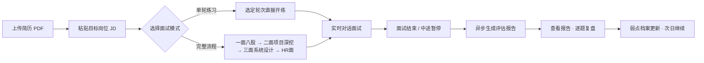
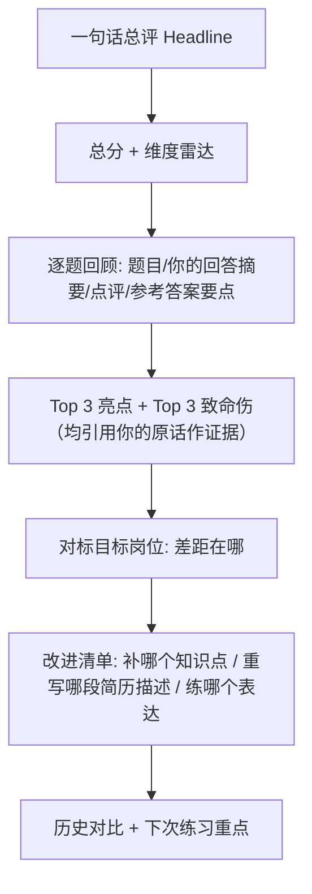
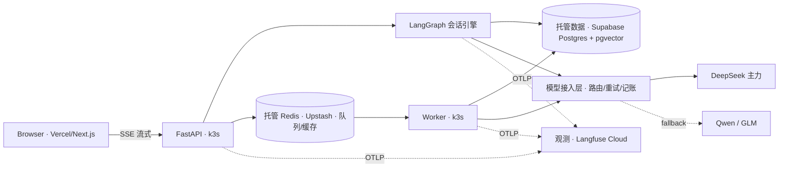
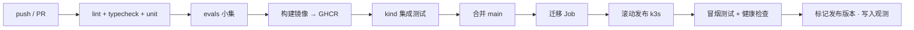

# Interview Agent · 总体设计文档

| 字段 | 内容 |
|---|---|
| 状态 | Draft v1.1（已按 3C2G 约束修订 + 二次调研并入，待评审） |
| 日期 | 2026-09-20 |
| 类型 | 总体设计（Master Design）· SDD 起点 |
| 工作流 | 本设计文档 → 里程碑 spec（`docs/specs/000N-*`）→ 实现计划 → 实现与验证 |

> 本稿状态：同类产品调研（§9）与技术模式调研（§3.2 / §3.7 / §3.8 / §4）结论均已并入。剩余待决事项见 §8。

---

## 0. 一页纸摘要

**做什么.** 一个面向中文技术面试场景的 AI 模拟面试官。支持四种面试轮：技术八股、项目深挖、系统设计、行为面/HR；可以单轮练习，也可以编排成一场完整模拟面试（一面 → 二面 → 三面 → HR 面），结束后输出结构化评估报告：维度评分 + 逐题点评 + 证据引用 + 改进清单。

**为什么做.** 借一个真实使用的产品，把工业级 Agent 工程完整练一遍，并把 CICD + K8s 部署链路全部走通。作品集定位：GitHub 公开，README / 架构图 / ADR / 演示材料随里程碑同步产出。

**核心约束.**

1. 单人开发，每周 30h+，v1 目标 8-10 周
2. **薄生产**：自有 3C2G VPS 跑 k3s，只部署 API 与 worker；数据层外推到免费托管（Supabase / Upstash）、前端上 Vercel，完整 CICD，真实公网运行
3. **本地全栈**：本地机器资源充足，用 kind 跑等价全栈（状态化工作负载、监控、自托管观测），承接重型工程练习
4. 模型：DeepSeek 主力（国产 API），架构预留多模型路由
5. v1 明确关闭项：语音、代码沙箱、多租户、移动端、公开发布（详见 §7）

**原则.** 每个组件都必须能回答「在练什么」；不为显得专业而堆技术。学习价值优先于产品完备。

---

## 1. 背景与目标

### 1.1 学习目标（第一优先级）

| 能力线 | 想练到的东西 | 在哪落地 |
|---|---|---|
| 编排与状态机 | LangGraph 子图、checkpoint 持久化、中断/恢复（HITL）、流式事件 | 面试会话引擎（§3.2） |
| RAG 与上下文工程 | 语料 ingestion、混合检索 + rerank、引用溯源、上下文压缩 | 题库 / 简历 / JD 检索（§3.3） |
| 评测体系 | LLM-as-judge、golden 数据集、分数稳定性、CI 回归 | `evals/` 与 CI 门禁（§3.7） |
| 可观测与成本 | tracing、token 记账、成本看板、模型路由、缓存 | 模型接入层 + OTel/Langfuse（§3.8） |
| 异步流水线 | 队列 + worker、报告生成、批量评测、K8s Job/CronJob | worker 服务（§3.5） |
| CICD + K8s | 镜像流水线、迁移任务、滚动发布、探针/HPA；状态化工作负载与备份恢复在本地 kind 全栈练；托管服务集成 | 部署体系（§4） |

### 1.2 成功标准（v1 Definition of Done）

1. 能完整练一场四轮模拟面试，可中断、可跨天恢复，不丢状态
2. 评估报告含维度评分、逐题点评、原文证据引用、对标目标岗位、可执行改进清单与下轮练习重点
3. 关键质量指标有回归测试并在 CI 里运行（题目相关性、追问质量、报告一致性、分数稳定性）
4. 每次会话在 Langfuse 可完整回溯；有单会话成本看板与预算告警
5. 一条 PR 合并即自动上线（含数据库迁移）；线上有健康检查、告警；备份恢复演练在本地全栈环境完成（生产数据层使用托管服务的备份能力 + 自有每日逻辑备份）
6. 作品集材料齐备：README、架构图、ADR 集、演示录屏、里程碑记录

### 1.3 非目标

不做商业化；不做公开注册的 SaaS；不做移动端；不追求「比市面产品强」，只追求「工程完整度与可讲述性」达到工业级。

---

## 2. 产品定义

### 2.1 用户与场景

唯一用户：正在准备技术面试的中文软件工程师（首先是作者本人）。典型场景：

- 晚上 30-60 分钟，练一场完整模拟面试，次日看报告复盘
- 针对某家公司的 JD，做「项目深挖」单轮特训
- 面试前一天，用电面模式快速过一遍八股高频题
- 多周持续使用，观察各维度分数的成长曲线

### 2.2 核心用户旅程

### 2.3 四种面试轮设计

每一轮 = 一位独立的「面试官 persona」+ 专属题型 + 专属评分 rubric。共享同一套会话引擎。

#### R1 技术八股轮（技术一面风格）

| 维度 | 设计 |
|---|---|
| Persona | 语速快、直接、追根究底的技术一面官；答得好就深挖一层，答不完整就换题 |
| 题型 | 语言 / 网络 / 数据库 / 操作系统 / 中间件 知识问答，来自题库 RAG |
| 机制 | 自适应难度：每题先初评正确性，再决定追问或换题；一轮 5-8 题 |
| Rubric | 正确性 · 原理深度（边界条件、底层机制）· 表达清晰度 · 诚实度（不会就说不会，乱编重罚） |
| 进阶机制（v1.1） | 引导性错误前提检测：面试官故意给出错误论断，观察候选人是否质疑 |

#### R2 项目深挖轮（技术二面风格）· 灵魂轮

| 维度 | 设计 |
|---|---|
| Persona | 抠细节的资深工程师；沿着「架构 → 你的职责 → 取舍 → 量化 → 失败复盘」由宽到窄推进 |
| 输入 | 简历解析出的项目清单 + 声称的技术点 |
| 机制 | 追问链（STAR-CTA）：数字怎么来的？当时另外两个方案是什么？如果流量 x10 会先炸哪？ |
| Rubric | 项目复杂度 · 个人贡献清晰度 · 技术深度 · 取舍与权衡意识 · 复盘反思 · 量化能力 |
| 附加产出 | 简历修改建议：凡是「吹了但答不上」的点，标记为简历该弱化或该补准备的项 |

#### R3 系统设计轮（架构面风格）

| 维度 | 设计 |
|---|---|
| Persona | 看权衡的架构面官；按 checklist 推进：需求澄清 → 高层设计 → 组件深挖 → 容量估算 → 瓶颈/扩展/故障 |
| 机制 | 长多轮（20-30 分钟）；一次只推进一个阶段；用户卡住时给最小提示而非答案 |
| 场景 | 短链、秒杀、IM、Feed、配额系统等（题库化） |
| Rubric | 需求澄清 · 结构化设计 · 容量估算 · 权衡取舍 · 深挖深度 · 沟通表达 |

#### R4 行为面/HR 轮

| 维度 | 设计 |
|---|---|
| Persona | 温和但敏锐的 HR；用 STAR 追问把模糊回答逼到具体 |
| 题型 | 冲突处理、失败复盘、协作、最得意的事、职业规划、离职原因（题库化） |
| Rubric | STAR 完整度 · 反思深度 · 动机清晰度 · 风险信号 · 表达 |

### 2.4 评估报告

原则：**每一条评价都必须有原文证据引用**；分数不可信的报告等于没有报告。调研验证了用户对报告的三项硬需求：有证据、有优先级、有下一步（见 §9.4）。

### 2.5 面试模式

- **单轮特训**：任选一轮，15-30 分钟
- **完整流程**：四轮编排，可跨天。状态持久化，随时暂停/恢复（断点续面）
- **复盘回顾**：历史会话回放与对比

反过度迎合约束：面试官 persona 必须保持真实面试的严格度，答得好可以表扬，但不得为了体验舒适而虚高给分（用评测集持续校准，见 §3.7）。

---

## 3. 系统架构

### 3.1 总览

生产只把 API 与 worker 放在 k3s（3C2G VPS）上，数据与前端外推（§4.1 三层环境）。本地用 docker compose 跑依赖做日常开发，本地 kind 跑等价全栈（状态化工作负载 + 监控）做重型练习与集成测试。

### 3.2 会话引擎（LangGraph）

- **父图（Session Graph）**：管理面试生命周期：准备 → 轮次推进 → 评估 → 结束。负责跨轮状态（用户档案、已问过的题、轮次结果）。
- **子图（Round Graph）**：每轮一个独立子图（`round_fundamentals` / `round_project` / `round_system_design` / `round_hr`），独立开发、独立测试、独立评测。
- **面试官节点**：单 agent + 工具集（题库检索、简历检索、已完成问题去重、难度调节），结构化输出「下一步动作」：追问 / 换题 / 换阶段 / 收尾。
- **评估官**：独立子图，面试结束后由 worker 异步调用，产出结构化报告 JSON（Pydantic schema 约束）。
- **Checkpointing**：`langgraph-checkpoint-postgres`（`AsyncPostgresSaver`；首次运行需 `.setup()` 建表；连接需 `autocommit=True` + `row_factory=dict_row`），`thread_id = session_id`；用户暂停后任意时刻恢复。
- **已知坑（写进回归测试）**：子图 `.compile()` 必须显式传入 checkpointer，否则会使用随机 UUID 命名空间并**静默丢失写入**（调研发现的真实故障模式）。
- **中断（HITL）**：`interrupt()` 用于「暂停面试」「用户请求提示」「提前结束」三类场景；恢复用 `Command(resume=payload)`。
- **流式**：图执行事件 → API 层 SSE → 前端逐 token/逐事件渲染（含「面试官正在思考/正在评价」等多种事件类型）。

**质量守卫（非 agent，先规则化）**：问题去重（embedding 相似度）、单轮题量上限、追问深度上限（防鬼打墙）、超时兜底。

### 3.3 RAG 与上下文工程

| 语料 | 来源 | 用途 |
|---|---|---|
| 八股题库 | 自建结构化题库（分类/难度/参考答案要点） | R1 出题与判分 |
| 系统设计题库 | 场景 + checklist + 优秀答案要点 | R3 出题与判分 |
| 行为题库 | STAR 题库 + 追问模板 | R4 |
| 用户简历 | PDF 解析 → 结构化项目清单 | R2 提问、R1/R3 个性化 |
| 目标 JD | 粘贴文本 → 结构化要求 | 全轮适配、报告对标 |

管线：解析 → 结构化抽取 → chunk → embedding → pgvector 入库；检索采用向量 + 关键词混合检索 + rerank；上下文按 token 预算做压缩（简历摘要常驻，题库按需检索）。

选型说明：v1 用 **pgvector**（寄宿在 Supabase 托管 Postgres 上，免运维且扩展自带）；Qdrant 作为可替换项记录在 ADR。

### 3.4 数据模型（核心表）

`users`（单用户占位）· `resumes` · `job_targets` · `sessions`（模式/状态/进度）· `rounds`（轮次/得分）· `messages`（对话流）· `questions`（题库）· `reports`（结构化报告 JSON）· `eval_runs`（评测批次与指标）· `cost_ledger`（token/成本记账）

### 3.5 异步流水线

- 队列：托管 Redis（Upstash，TLS）+ **arq**（asyncio 原生，配合 FastAPI 最顺；Celery 重且与 async 别扭）
- 任务：报告生成、题库 embedding 重建、简历解析（上传后异步）
- K8s 形态：worker Deployment（单副本，内存受限）；**重型批处理（夜间全量评测、embedding 重建）放 GitHub Actions 或本地，不占 3C2G 的 VPS**
- 任务幂等：任务带 `session_id + attempt`，重复消费不产生重复报告

### 3.6 模型接入层

- Provider 抽象：统一接口（chat / structured output / streaming），DeepSeek 主力，Qwen/GLM 可切换
- 路由策略：对话默认 `deepseek-chat`；评审/难题追问/报告撰写用强模型（`deepseek-reasoner` 或同级）；评测 judge 固定模型版本（保证分数可比）
- 可靠性：超时、指数退避重试、熔断、降级（失败时切换备选 provider）
- 成本：每次调用记 token 与费用入 `cost_ledger`；prompt 缓存（长上下文复用）；预算告警
- 结构化输出：全部关键节点使用 schema 约束 + 解析失败重试；不使用「让模型输出 JSON」的裸 prompt

### 3.7 评测体系（工业级分水岭）

| 层次 | 内容 | 频率 |
|---|---|---|
| 组件级 | 检索命中率（题库）、简历解析准确率、结构化输出合法率 | 每次 PR |
| 行为级 | 题目相关性评分、追问是否基于回答、是否重复提问、面试官口吻一致性 | 每次 PR（小集） |
| 报告级 | rubric 依从度、证据引用率、**分数稳定性**（同一 transcript 生成 N 次，方差 < 阈值） | 每次 PR + 夜间全量 |
| 会话级 | 完整四轮 golden 会话回归 | 夜间 + 发布前 |

**工具链（调研结论）**：

- **DeepEval（主力）**：pytest 原生，LLM-judge 指标（faithfulness / answer relevance / agentic task completion）直接进现有测试套件；`deepeval test run` 非零退出即阻断合并；用 `@pytest.mark.parametrize` 组织 golden 用例。
- **Promptfoo（补充）**：YAML 驱动的 prompt / 模型回归，跑得快（<30s），擅长抓「格式契约破坏」；在 prompt 密集迭代期引入。
- **Ragas（可选）**：RAG 专项指标（检索质量 / 上下文相关性），RAG 管线调优期补充，不作唯一门禁。
- **Langfuse datasets（在线层）**：人工标注与线上评分回填，不做 CI 门禁。

分工经验：DeepEval 抓语义漂移，Promptfoo 抓格式破坏，两者互补（业界常用组合）。golden 数据集 15-30 条起步，逐步扩充；judge 模型与 prompt 均版本化并随提交固化基线。CI 中评测失败 = 阻断合并。

用户反馈回路：报告页「评分准不准」一键反馈，进数据集候选池。

### 3.8 可观测性与成本工程（OTel 优先）

- **埋点策略：OpenTelemetry 优先**。全链路用 OTel 语义埋点（LLM span 遵循 GenAI 语义约定），后端可替换。厂商中立，避免被单一 SDK 绑定。
- **v1 后端：Langfuse Cloud**（免费层：5 用户 / 50 万 observations 每月 / 10 datasets，个人使用绰绰有余）。支持 OTLP 摄入，tracing + prompt 版本 + 评分回填一次到位，零运维。
- **自托管（M6 可选教学项）：Arize Phoenix，跑在本地 kind 上**。单容器，约 0.5-1 GiB 内存，OTel 原生（4317 / 6006），内置 evaluators 与 datasets；切换成本只是加一个 OTLP exporter。
- **明确排除：自托管 Langfuse v3/v4**。官方最低要求约 10 CPU / 25 GiB 内存（Web + Worker + Postgres + Redis + ClickHouse + Blob），单台 VPS 跑不动。记入 ADR。
- **成本看板**：单会话成本、单轮成本、模型分布、日/周趋势；月预算告警；数据来自模型接入层的 `cost_ledger`。
- **基础监控**：Prometheus + Grafana（轻量配置）；关键告警：API 5xx、队列积压、LLM 失败率、磁盘/内存。

### 3.9 安全与隐私（轻量版）

- 入口：**Vercel 同源代理（BFF）**——浏览器只与 Vercel（HTTPS）通信，Vercel 服务端把 `/api/*` 转发到 API。API 只暴露 HTTP，无域名/TLS/CORS/混合内容问题；M1 加 LLM 端点前必须加代理密钥校验
- Prompt injection：简历与 JD 是**不可信输入**，注入点隔离（作为数据不作指令、输出侧过滤）；评测集中加入注入攻击用例
- PII：简历数据仅存自建库；报告与日志避免泄入第三方
- Secrets：SOPS（或 sealed-secrets）加密入库，仓库不落明文；托管服务凭据（Supabase / Upstash）走同一套，连接串只注入服务端

---

## 4. 部署与交付

### 4.1 环境拓扑（三层）

| 环境 | 形态 | 用途 | 练什么 |
|---|---|---|---|
| dev | 本地 docker compose（PG + Redis）+ `uv run uvicorn` + `next dev` | 日常开发 | 快速迭代 |
| local-full | 本地 kind（可建**多节点**：1 control-plane + 2 workers）：**等价全栈**（Postgres+pgvector、Redis、MinIO、kube-prometheus-stack、Phoenix） | 重型工程练习 + CI 集成测试 | StatefulSet/PVC、备份恢复演练、监控栈、自托管观测、真多节点调度/HPA/驱逐演练 |
| prod | 自有 **3C2G VPS** + k3s：只跑 API + worker（Traefik Ingress，仅 HTTP；公网入口经 Vercel 同源代理） | 真实公网运行 | 滚动发布、探针、资源限额、密钥、迁移 Job、CICD |

数据与前端外推：Supabase（Postgres + pgvector + Storage）、Upstash（Redis）、Vercel（前端）、Langfuse Cloud（观测）。
应用通过环境变量切换数据端点，同一套代码在 local-full 与 prod 之间保持行为等价（12-factor）。迁移与评测在 CI 的 kind 里验证；生产发布 = 镜像更新 + 迁移 Job。

### 4.2 CICD 流水线（GitHub Actions）

- CD 形态：后端「Actions + Helm/kubectl 滚动更新」到 k3s；前端走 Vercel 的 Git 集成（PR 预览 + 主分支自动发布），本身就是 CICD 练习；GitOps（ArgoCD）作为 M6 评估项（§8）
- 评测门禁：prompt 或 agent 逻辑变更必须过 evals；夜间跑全量
- 回滚：镜像 tag 回退 + 迁移向前兼容（expand/contract 模式）

### 4.3 组件清单（按环境分层）

**生产（3C2G VPS，k3s，薄）**

| 组件 | 形态 | 说明 |
|---|---|---|
| API | Deployment + Service + Ingress（仅 HTTP） | requests/limits 严格设置；公网入口经 Vercel 同源代理（BFF，见 §3.9）；HPA 清单照写（单节点下以 `kubectl top` / 驱逐演练为主） |
| Worker | Deployment（1 副本） | 队列驱动；并发 = 1，控内存 |
| 迁移 | Job（Helm pre-upgrade hook） | 打托管 Postgres；expand/contract 兼容 |
| 托管数据入口 | ExternalName Service（`pg` / `redis`） | 应用固定连 `pg:5432` / `redis:6379`，由 Service 指向 Supabase / Upstash（环境无关）；连接走 Supavisor pooler，session 模式，池很小（API 5 / worker 2） |
| 观测 | Langfuse Cloud（OTLP 上报） | 不占 VPS 资源 |
| 密钥 | SOPS + age → K8s Secret | 加密后进 Git |

**本地 kind（全栈练习场）**

| 组件 | 说明 |
|---|---|
| Postgres + pgvector | StatefulSet + PVC；备份/恢复演练 |
| Redis | StatefulSet |
| MinIO | S3 兼容对象存储 |
| kube-prometheus-stack | 监控（资源充足才跑得动） |
| Phoenix | 自托管 LLM 观测（OTel） |
| HPA / 压测 | 3 核 VPS 上做不出的横向扩展练习 |

**托管服务（免费层）**

| 服务 | 角色 | 备注 |
|---|---|---|
| Supabase | Postgres + pgvector + Storage | 额度与暂停策略见 §6 风险 |
| Upstash | Redis（队列/缓存） | TLS；命令量配额 |
| Vercel | Next.js 前端 | PR 预览部署 |
| GHCR / Langfuse Cloud | 镜像 / 观测 | 免费 |

### 4.4 机器规格与资源预算（3C2G，已按调研校准）

2 GB 是 k3s 官方 server 节点下限，必须裁剪与调优：

- **k3s 组件**：保留 Traefik（要练 Ingress）、ServiceLB、metrics-server；关闭 local-storage（生产无集群内状态化负载）。
- **GOMEMLIMIT=800MiB**：让 k3s 的 Go runtime 更积极 GC，空闲内存可从约 1.2 GB 降到约 750 MB。
- **kubelet 预留与驱逐（必设）**：`system-reserved=memory=300Mi`、`kube-reserved=memory=600Mi`、`eviction-hard=memory.available<100Mi,nodefs.available<10%`、`max-pods=50`。不设 `memory.available` 驱逐阈值时，内核 OOM killer 可能直接杀掉 k3s-server（已有级联故障案例）。
- **Swap**：`fail-swap-on=false` + `feature-gates=NodeSwap=true` + `swapBehavior: LimitedSwap`，宿主机 2 GB swapfile 兜底。注意 Guaranteed 类 pod 不能用 swap，所以 pod 设 requests < limits。
- **内存预算**：k3s + Traefik + metrics-server 约 850-1000 MB；API limits ≤ 500 MB、worker ≤ 300 MB；可分配给工作负载约 1.0-1.1 GB，紧但可行。
- **纪律**：VPS 上**不要同时跑 Docker 与 k3s**（两套 containerd/iptables，最低合计约 1 GB）；worker 并发 = 1；评测 / embedding 批处理放 CI 或本地；开 OOM 告警。
- **成本**：VPS 已有（0 增量）；Supabase / Upstash / Vercel Hobby / R2 / GHCR / Langfuse Cloud 免费层；主要支出 = 模型 API（¥50-200/月）。

---

## 5. 里程碑计划（垂直切片，M0 走路骨架）

> 每周 30h+ 估算；每个里程碑结束：可运行版本 + 演示截图 + 文档更新 + 回顾。

### M0 · 走路骨架（第 1 周）

**目标**：打通「浏览器 → CI → 镜像 → k3s → 公网 URL」全链路（hello world 级），并备好三层环境。
交付：仓库脚手架；FastAPI `/healthz` + 前端（Vercel）显示版本号；多阶段 Dockerfile；GitHub Actions（lint/typecheck/test → evals 骨架 → GHCR → 部署）；3C2G VPS 上 k3s + Traefik 就位；Supabase / Upstash 开通并连通（连接池 + 密钥管理）；本地 kind 全栈骨架（PG/Redis/MinIO）；Langfuse Cloud 接通；CI badge 与公网 URL。
学习点：集群搭建与资源预算、镜像发布、发布流水线、入口与 TLS、托管服务接入、ADR-0001/0002/0009。

### M1 · 项目深挖轮 E2E（第 2-3 周）· 第一个真功能纵切

**目标**：能完整练一轮项目深挖并拿到评估报告。
交付：简历上传解析（异步）；会话状态模型 + LangGraph 单轮子图；SSE 流式聊天 UI；checkpoint 持久化 + 暂停/恢复；报告生成 worker + 报告页；rubric v1；评测 harness v0（DeepEval 打底：结构化输出合法率 + 报告一致性 + 分数稳定性，进 CI）。
学习点：LangGraph 子图/状态/checkpoint、流式全链路、结构化输出、评测初体验、迁移上线。

### M2 · 八股轮 + RAG 管线（第 4 周）

**目标**：题库 RAG 全链路 + 自适应难度。
交付：题库 ingestion 管线（解析/结构化/chunk/embedding/pgvector）；混合检索 + rerank；自适应出题与去重；RAG 评测（检索命中率、题目相关性，Ragas / DeepEval RAG 指标）进 CI。
学习点：RAG 工程质量、检索评测。

### M3 · HR 轮（第 5 周上半）

**目标**：行为面轮上线（四轮中最快的一轮，验证「加轮次只需加内容」）。
交付：行为题库 + STAR rubric + 追问模板。

### M4 · 系统设计轮（第 5 周下半 - 第 6 周）

**目标**：难度最高的一轮：长多轮 + 阶段推进 checklist。
交付：系统设计题库、阶段化推进机制、容量估算评分、卡壳提示策略。

### M5 · 完整流程模式 + 成长体系（第 7 周）

**目标**：四轮编排、「一场完整模拟面试」上线。
交付：父图多轮编排、跨轮记忆与衔接、统一总报告、断点续面（跨天）、弱点档案与历史对比。

### M6 · 生产硬化 + 成本工程 + 作品集收口（第 8 周）

**目标**：工业级收尾。
交付：资源治理与告警、成本看板与预算告警、免费层配额监控（Supabase/Upstash/Vercel）、模型路由落地、**本地 kind 多节点上的调度 / HPA / 驱逐演练与备份恢复演练**、轻量压测（k6）、runbook、README/架构图/demo 录屏；可选挑战：本地自托管 Phoenix（OTel）、ArgoCD GitOps 迁移、vLLM 小模型分流。
学习点：容量与稳定性、成本治理、可运维性。

---

## 6. 风险与对策

| 风险 | 概率/影响 | 对策 |
|---|---|---|
| 范围蔓延（想做的越来越多） | 高/高 | §7 关闭清单 + v2 候选池机制；任何新点子先入池，里程碑评审时再决策 |
| 3C2G 生产机 OOM / 驱逐 | 高/中 | 只跑 API/worker；严格 limits + worker 并发 1；kubelet 预留与 `eviction-hard` 必设（防内核 OOM 杀 k3s）；`GOMEMLIMIT` + 2 GB swap；批处理放 CI/本地；OOM 告警 |
| Supabase 免费层闲置暂停（1 周无活动即暂停，免费层无法关闭） | 中/高 | 每周保活 ping（CI CronJob）；每日逻辑备份到 Cloudflare R2；端点可切换（自建 / Neon 付费） |
| Upstash 免费层配额（50 万命令/月、仅 1 个库） | 中/中 | 命令量与队列长度纳入监控；优化缓存命中；超限则降级或换付费/自建 |
| Vercel Hobby 仅限非商用 | 低/中 | 本项目为个人 / 作品集用途，符合；若将来商用需升 Pro |
| 托管数据层跨区延迟 | 中/中 | Supabase / Upstash 选亚洲区（新加坡 / 东京）；Supavisor session 池 + 小连接数；热点数据本地缓存 |
| LLM 输出不稳定 / 质量波动 | 高/中 | 结构化输出 + 重试；评测门禁拦截回归；provider 抽象 + fallback |
| LangGraph 学习曲线拖慢进度 | 中/中 | M0-M1 预留学习 buffer；官方文档 + §9.2 参考实现先行 |
| 评测集构建低估工作量 | 中/中 | 从 15 条 golden 起步，随使用迭代扩充；评测 harness 复用报告管线 |
| 单人项目动力与 bus factor | 中/高 | 每周可见进展（走路骨架红利）；里程碑回顾；公开仓库形成外部承诺 |
| 作品集「似曾相识」（同类开源多） | 中/中 | 差异化叙事放在工程质量：评测门禁、成本治理、可运维性、SDD 文档（§9.2 结论）；README 开门见山讲这一点 |

## 7. v1 关闭项与 v2 候选池

**v1 明确不做（关闭）**：语音面试（ASR/TTS）、代码题沙箱与算法判题、多租户/公开注册、移动端、通知系统（邮件/IM 提醒）、白板画图、商业化能力。

**v2 候选池（只记录，不做承诺）**：语音轮、算法轮 + 沙箱、系统设计白板协作、英文面试模式、公司风格包（按大厂风格定制题库与面试官口吻）、面试计划与日历、移动端、vLLM 自部署模型分流、群面模拟。

## 8. 待决事项（Open Questions）

| # | 事项 | 结论 / 选项 | 状态 |
|---|---|---|---|
| Q1 | 3C2G VPS 的区域与入口 | ✅ 已定：境外 VPS；入口用 Vercel 同源代理（BFF），API 仅 HTTP | 已定 |
| Q2 | 免费层选型与区域 | **已定**：Supabase（新加坡 / 东京）+ Upstash + Vercel Hobby（非商用）+ R2（备份）；Neon 排除（免费层无亚洲区 + 5 分钟自动挂起） | 已定 |
| Q3 | 评测工具链 | DeepEval 主力 + Promptfoo 补充 + Ragas 可选（§3.7） | 已定 |
| Q4 | CD 形态 | 起步 Actions + Helm/kubectl；M6 评估 ArgoCD GitOps 迁移 | 已定（分层） |
| Q5 | 观测自托管 | v1 Langfuse Cloud；自托管改选 Phoenix（本地 kind） | 已定 |

## 9. 同类参考（调研结论）

### 9.1 商业产品一览

| 产品 | 定位 | 价格 | 用户主要抱怨 |
|---|---|---|---|
| 牛客 AI 面试 | 企业 B 端批量面试；Ultra 版有实时语音、数字人、7 维评估 | 企业报价 | C 端用户吐槽「就是选择题/填空题」、无语音对话、题目不贴简历 |
| 海纳 AI | 企业招聘助手；深度沟通 2.0 有 STAR 式多轮追问；1200 万+ 场面试 | 企业授权 | 是筛选工具不是教练工具：候选人无法重练 |
| 面试鸭 | 题库刷题（聚合真实面经） | 免费 + ¥69-199/月 | 「题库全但 AI 追问深度几乎为零」，不随回答自适应 |
| 牛面 | 面向候选人：简历押题 + 模拟 + 逐题回放 | ¥9-168/次 | 押题命中率低；报告只有分数，没有改进路径 |
| Final Round AI | 实时副驾（面试中提示）+ 模拟练习，10M+ 用户 | $81-148/月 | 实时延迟 3-5 秒、卡顿；回答泛化；反馈只会说「改进语气」 |
| LockedIn AI | 实时副驾，宣称 116ms 延迟 | $39-55/月 | 单场 90 分钟上限，长系统设计轮中途断线 |
| interviewing.io | 真人 FAANG 工程师模拟面试 | $225-339/场 | 贵；真人质量参差 |
| HireVue | 企业视频面试分析（微表情/语调） | 企业报价 | 候选人反感被 AI 分析；题目照本宣科 |
| Google Interview Warmup | 纯文本练习 | 免费 | 「就是个表单」，无语音无追问；已于 2026-04 下线 |
| InterviewMan | 实时副驾，20+ 隐身功能 | $12-30/月 | 面试中使用工具的心理负担；Linux 支持缺失 |

### 9.2 值得借鉴的开源实现

| 项目 | 架构要点 | 可借鉴处 |
|---|---|---|
| [daixinwang/interview-gpt](https://github.com/daixinwang/interview-gpt) | FastAPI + LangGraph + Next.js；Orchestrator→Interviewer→Evaluator→Reporter 状态机；ChromaDB | 技术栈与我们几乎相同，可直接研究其状态机与报告设计 |
| [saadshahidit/interview-forge](https://github.com/saadshahidit/interview-forge) | RAG（简历→ChromaDB）+ Mem0 跨会话记忆 + Redis 后台 worker | 跨会话弱点追踪、后台评估 worker 的落地方式 |
| [tsgxiaode/interview-agent](https://github.com/tsgxiaode/interview-agent) | LangGraph 多 agent：简历 → JD → 出题 → 面试 → 评估 → 报告 | 角色拆分的边界划分 |
| [WuJiaJun1020/ai-interview-agent](https://github.com/WuJiaJun1020/ai-interview-agent) | LangGraph + 显式面试策略阶段（开场匹配 → 项目证据 → 追问补证 → 能力缺口 → 收束）+ 69 题题库 | 面试策略阶段化，与 R2 追问链思路一致 |
| [IliaLarchenko/Interviewer](https://github.com/IliaLarchenko/Interviewer) | 语音优先（Web Speech API STT/TTS），模块化模型配置 | v2 语音轮的参考 |
| [AryanSivanandan/InterviewAgent](https://github.com/AryanSivanandan/InterviewAgent) | LangGraph + FastAPI + 流式 + LlamaGuard 审核 | 生产化脚手架与内容审核 |

**结论**：同类开源实现不少、架构高度相似（LangGraph + RAG + 报告）。这印证了本项目的差异化不在功能新颖度，而在**工程质量**（评测体系、可观测、成本治理、可运维性、SDD 文档），恰好是我们要练的东西。

### 9.3 用户反馈验证的五大失败模式

1. **题目泛化、不贴背景**：不管简历和岗位，问来问去那几道「自我介绍」
2. **追问浅甚至没有追问**（最高频抱怨）：答完就换下一题，这是模拟面试「没用」的头号原因
3. **报告无用**：只有「表达一般、逻辑待提高」这类废话，没有证据、没有优先级
4. **纯文本或语音延迟**：打字练不到真实压力场景；语音延迟 3-5 秒直接毁掉节奏
5. **无跨会话记忆**：每次从零开始，不记得你上次 STAR 没讲好

### 9.4 好报告的标准（用户口径）

- 逐题评分 + **引用原话做证据**
- **2-3 条**最高优先级改进项，不是 15 条泛泛建议
- **对标目标岗位要求**：我的回答 vs 岗位需要的差距
- 可回看 transcript
- **明确的下轮练习重点**（形成进阶感）

### 9.5 调研结论对本设计的直接影响

1. 评测工具链定案：DeepEval 主力 + Promptfoo 补充（§3.7）
2. 观测改为 OTel 优先 + Langfuse Cloud（v1）；排除自托管 Langfuse（需约 10C/25G），自托管改选 Phoenix（§3.8）
3. VPS 规格两轮修正：调研建议 8C16G → 受自有 3C2G 约束，改为「薄生产 + 托管数据 + 本地全栈」三层拓扑（§4.1 / §4.4）
4. 报告设计补齐「对标目标岗位」与「下次练习重点」（§2.4）
5. 差异化定位明确：针对失败模式 2/3/5（追问链 / 证据化报告 / 弱点档案）+ 工程质量叙事
6. 3C2G 约束下的二次调研：k3s 需裁剪 + kubelet 预留/驱逐必设（否则内核 OOM 可能杀控制面）；免费层定案 Supabase + Upstash + Vercel Hobby + R2，Neon 因免费层无亚洲区且 5 分钟自动挂起而排除

> 主要来源：[知乎 C 端评测](https://zhuanlan.zhihu.com/p/2052703494906422532) · [面灵 AI 评测](https://www.mianlingai.com/blog/mianshiya-review-2026) · [Reddit: Final Round AI](https://www.reddit.com/r/careerguidance/comments/1odtrag/) · [Reddit: AI Interview Tools](https://www.reddit.com/r/AIInterviewTools/comments/1s68hg5/) · [Hacker News: Interview Warmup](https://news.ycombinator.com/item?id=31605131) · [interviewing.io 评测](https://dev.to/alex_hunter_44f4c9ed6671e/is-interviewingio-worth-it-in-2025-an-honest-review-3ne5) · [海纳 AI](https://hina.com/blog/370) · [牛客企业版](https://hr.nowcoder.com/article/2463)

## 10. 工作流约定（SDD）

1. **设计先行**：本文件是唯一总体设计源（source of truth）；重大变更走 ADR（`docs/adr/000N-*.md`）
2. **里程碑 spec**：每个里程碑开工前写 `docs/specs/000N-mX-*.md`（范围 / 验收标准 / 接口 / 测试计划），评审通过再写实现计划
3. **实现计划**：由 writing-plans 产出，任务粒度为可验证的单步；每步有验证方式
4. **完成定义**：测试 / 评测证据齐全才算 done；每个里程碑收尾更新本文档状态与 README
5. **回顾**：里程碑结束记录「学到了什么 / 下里程碑调整」，累积进仓库
6. **提交规范**：约定式提交；prompt 与评测集变更单独成提交（便于回溯质量）

### 计划中的 ADR（随里程碑产出）

| ADR | 主题 |
|---|---|
| ADR-0001 | 三层拓扑：薄生产（3C2G k3s）+ 托管数据 + 本地全栈 kind |
| ADR-0002 | pgvector 而非独立向量库 |
| ADR-0003 | arq 而非 Celery |
| ADR-0004 | OTel 优先埋点 + Langfuse Cloud（明确排除自托管 Langfuse） |
| ADR-0005 | 评测工具链：DeepEval + Promptfoo |
| ADR-0006 | CD 形态演进：Helm/kubectl → ArgoCD |
| ADR-0007 | 简历/JD 的 prompt injection 防护策略 |
| ADR-0008 | 3C2G VPS 的区域与入口方案（Q1 决策后补） |
| ADR-0009 | 免费托管选型（Supabase / Upstash / Vercel / R2；排除 Neon）与端点可切换设计 |
| ADR-0010 | 公网入口用 Vercel 同源代理（BFF），不给 API 上 TLS（取舍：省掉 cert-manager 练习与域名成本，换取 M1 SSE 需按每轮短连接设计） |
